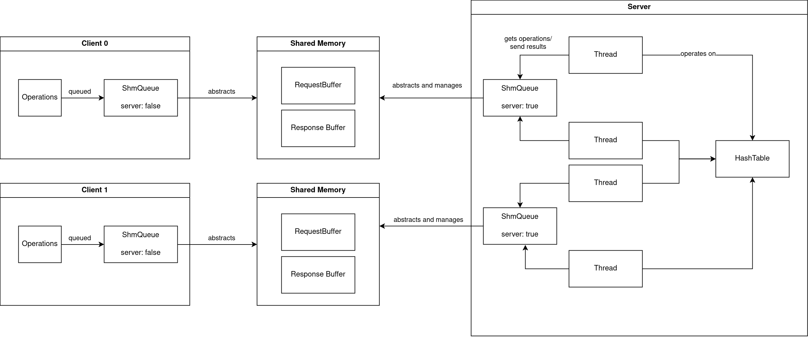

# Hash table implementation with client-server communication via POSIX shared memory
This repository contains a simple hash table implementation, an abstraction to do operations on this hash table via shared memory and an example server and client implementation.


## Requirements
 * cargo and rustc version 1.81.1  (latest stable version)
 * make (when using make file)
 * Tested on a Linux 6.11.2 kernel

## Building
Either run `make` or `cargo build --release`

## Running
### Server
The server takes three arguments:
- The number of buckets in the hash table
- The number of clients that can connect to the server
- The number of threads per client

One example of starting a server with 100 buckets, 2 clients and 3 threads per client:
```
./target/release/hashtable_shm_server 100 2 3
```

The server must be started before the client.

### Client
The client takes as it first argument the client id (starting from 0) and then a list of operation to send to the server:
- `insert <key> <value>`: insert a new key
- `read <key>`: read a key
- `delete <ke>`: delete a key

While the data structures itself are implemented to have variable key and value types, build server and client expected unsigned 32bit integers.

Example for two clients:
```
./target/release/hashtable_shm_client 0 insert 1 2 insert 2 4
```

```
./target/release/hashtable_shm_client 1 read 1 read 2
```

## Design

The hash table is implemented using a RwLock on each bucket. Therefore operations only block when multiple write or mixed read write operations are done of the same bucket (i.e same hash of the key).

For the client-server communication shared memory is used containing to ring buffers for queuing requests and responses. Each client has its own shared memory with the server.
Those each have an exclusive lock so that either the client or server can operate on the request/response buffer.

On the server side per client a number of threads are processing the operations for the hash table and then put a response back to the client.



## Scalability
This implementation can be scaled by the number of clients and on how many threads are working on the server side.
As longs as the clients do not operate on the same buckets (or only read) the clients can scale mostly independently from each other.

To avoid collisions in the hash table the number of buckets can be increased.

## Tradeoffs
 - Fixed key and value size: the communication via shared memory uses a ring buffer data structure. This allows us to queue multiple operations at once from the client, but requires a fixed size for the entries in the buffer.
 - Execution oder of queued commands is not linear: they are processed once a thread is free, which means if one of them acquires the lock earlier it get executed first.
  - We assume that neither the client or server panic while holding the shared locks for this exercise.